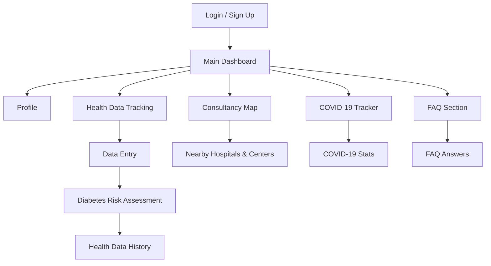

# BioWell: Health Tracking App for iOS

BioWell is a health tracking application developed for iOS using Swift and UIKit. The app helps users monitor their health metrics, access health resources, and find medical support easily.

## Features

- **User Authentication**: Secure sign up and login using Firebase Authentication.
- **Health Data Tracking**: Users can input and track key health metrics including:
  - Blood pressure (systolic and diastolic)
  - Blood glucose level
  - Body Mass Index (BMI)
  - Weight and height
  - Age and physical activity
- **Diabetes Risk Assessment**: The app calculates and displays the user's risk of diabetes based on entered health data.
- **Health Data History**: All health records are stored and displayed in a table for easy review.
- **Profile Management**: Users can view their profile information (name, email, phone, age) fetched from Firebase.
- **Consultancy Map**: Find nearby hospitals and health centers on an interactive map. Search by district and view locations with pins.
- **COVID-19 Tracker**: Get real-time COVID-19 statistics for any country, including active cases, new cases, deaths, and recoveries.
- **FAQ Section**: Access a curated list of frequently asked health questions and answers, covering topics like stress relief, balanced diet, diabetes, BMI, meditation, COVID-19 symptoms, and more.

## Technologies Used
- Swift, UIKit
- Firebase Authentication & Realtime Database
- MapKit & CoreLocation
- REST API for COVID-19 data

## Getting Started
1. Clone the repository and open `BioWell.xcodeproj` in Xcode.
2. Install dependencies (Firebase, etc.) via CocoaPods if needed.
3. Add your own `GoogleService-Info.plist` for Firebase configuration.
4. Build and run the app on an iOS device or simulator.

## App Overview

BioWell empowers users to manage their health through a comprehensive set of features. Below is a typical navigation flow to help visualize how users interact with the app:

### App Navigation Flow

1. **Launch & Authentication**
   - User opens the app and is greeted with a login or sign-up screen (Firebase Authentication).
2. **Main Dashboard**
   - After login, the user lands on the main dashboard with access to all core features.
3. **Profile Management**
   - Users can view and update their profile (name, email, phone, age).
4. **Health Data Tracking**
   - Navigate to the health monitor to input new health data (blood pressure, glucose, BMI, etc.).
   - Instantly receive diabetes risk feedback after data entry.
   - View historical health records in a table.
5. **Consultancy Map**
   - Access the map to search for nearby hospitals and health centers by district.
6. **COVID-19 Tracker**
   - Enter a country name to view real-time COVID-19 statistics.
7. **FAQ Section**
   - Browse and read answers to common health questions.

All features are seamlessly integrated with Firebase for secure data storage and real-time updates. Built with Swift and UIKit, BioWell delivers an intuitive and modern iOS experience for users seeking to improve their health and well-being.
